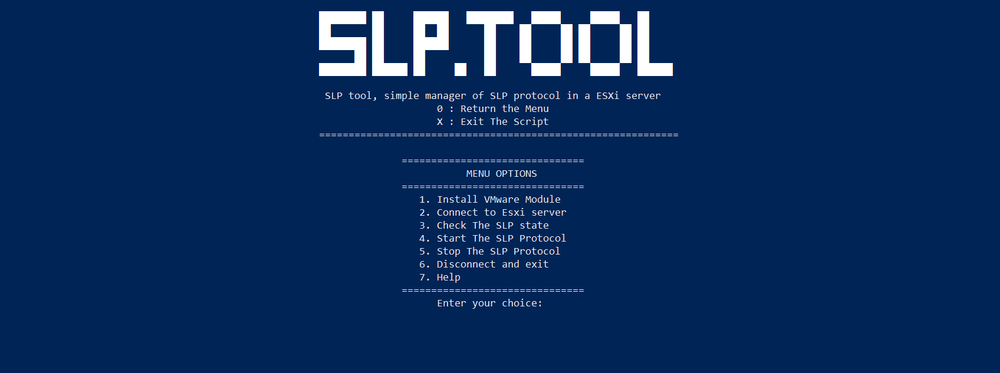

# SLP Tool

SLP Tool is a PowerShell script that allows you to manage the Service Location Protocol (SLP) on an ESXi server. With this tool, you can start and stop the SLP service, check if SLP is enabled or disabled on the ESXi server, and more.



## Prerequisites

- Windows PowerShell 5.1 or higher
- VMware PowerCLI module installed
- Access to an ESXi server with administrative privileges

## Installation

1. Download the latest release of the SLP Tool from the GitHub repository.
2. Extract the contents of the downloaded ZIP file to a folder of your choice.
3. Execute the script `./SLP_tool.ps`
4. Then you should install PowerCLI module by pressing the first option in script 

## Usage

#### Start SLP Service

To start the SLP service on an ESXi server, open a PowerShell console and run the following command:

```powershell
.\slp-tool.ps1 
```
Then you should select the 4 option 

#### Start SLP Service

To Stop the SLP service on an ESXi server, you should select the 5 option 

#### Check SLP Status 

To check the status of SLP in esxi server you sould select the 3 option 

#### Help :

For more information about the SLP protocol you can press 7 option to display some information about esxi attacks and how can use the script  

## Contact information :
- [Facebook](https://www.facebook.com/profile.php?id=100082569926842)
- [Twitter](https://twitter.com/HamzaAchahboun3)
- [LinkedIn](https://www.linkedin.com/in/achahboune-hamza/)
- [Redit](https://www.reddit.com/user/HamzaVerde)
- [Youtube](https://www.youtube.com/channel/UCVIOkzY9OijnUJ-daoZsXqw)

## Credits
This project was developed by Hamza Achahboune . 